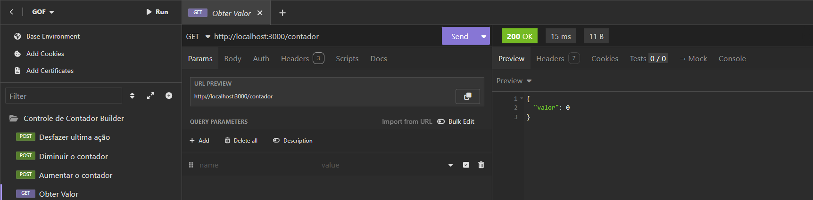
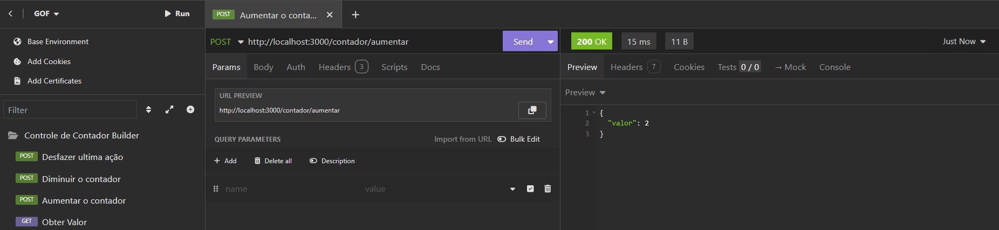
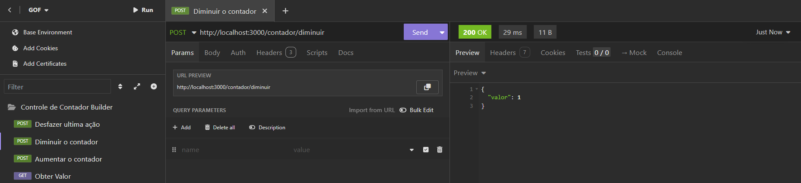
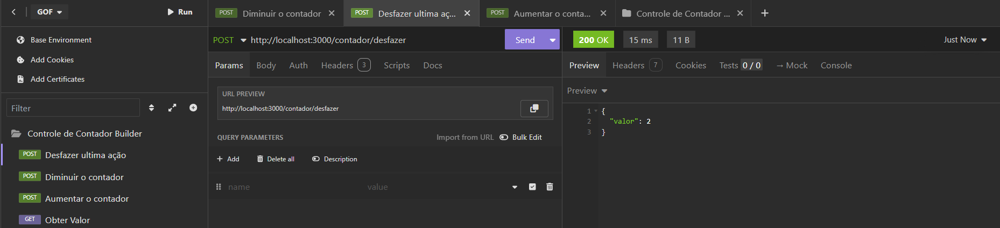

## Design Patterns
- Soluções clássicas baseadas no livro Gof (Gang of four, "A gangue dos 4")

| Solução clássica:  | Command |
| ------------------ | ------- |
| Padrão de Projeto: | aaaaa   |


Terminal:
    ```
    cd gof
    npm i express cors dotenv
    prisma init --datasource-provider mysql
    ```

Arquivo - .env :
    ```
    DATABASE_URL="mysql://root@localhost:3306/trab-gof"
    PORT=6542
    ```

Insonmia:
|Comandos|Print|
|-|-|
| Ver o valor |  |
| Adicionar valor |  |
| Diminuir o valor |  |
| Desfazer última ação |  |

### Participantes
- Isabelle Almeida
- Matheus Neves