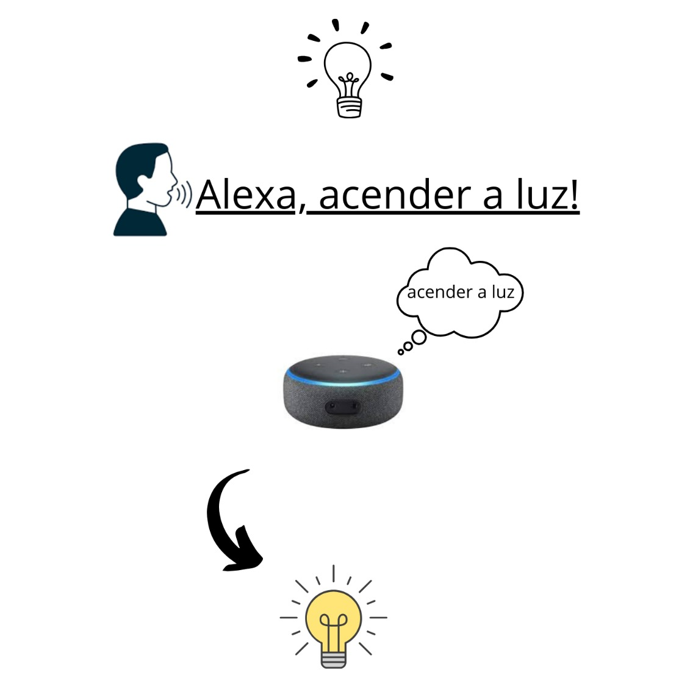
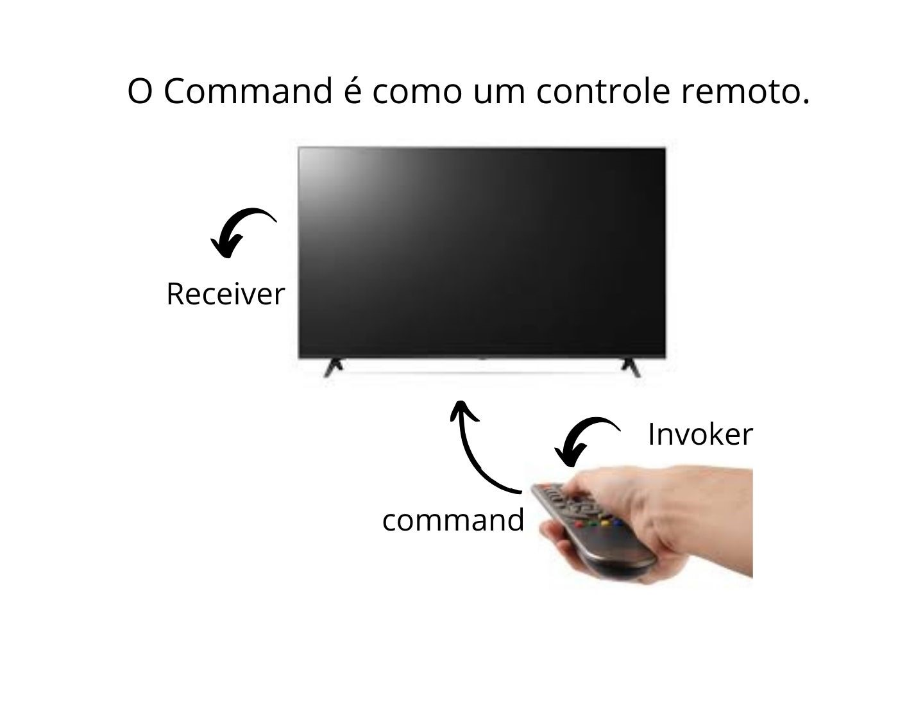
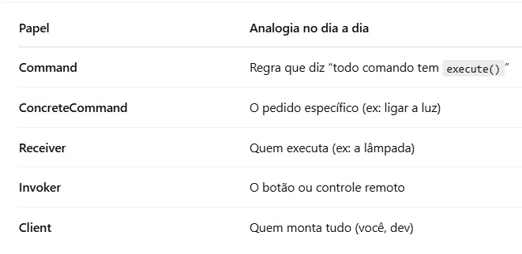
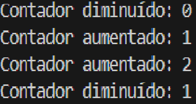

## Design Patterns
- Soluções clássicas baseadas no livro Gof (Gang of four, "A gangue dos 4")

# Command
O Command encapsula uma solicitação como um objeto, permitindo parametrizar clientes com diferentes solicitações, enfileirar ou registrar solicitações, e oferecer suporte a operações como desfazer/refazer.

 

### Exemplo:
O Command é como um controle remoto. Você aperta o botão (Invoker), que envia o comando (Command) para a TV (Receiver) fazer alguma coisa. Assim, quem aperta não precisa saber como a TV funciona por dentro.


### Estrutura do Command
| Componente      | Função                                                                                         |
| --------------- | ---------------------------------------------------------------------------------------------- |
| Command         | É só uma interface que diz: "todo comando tem que ter um método chamado execute()"             |
| ConcreteCommand | É o comando de verdade. Ele sabe exatamente o que fazer e com quem falar para fazer acontecer. |
| Receiver        | É quem realmente executa a ação. É o “funcionário” que entende o que fazer.                    |
| Invoker         | É quem chama o comando, sem se preocupar com o que ele faz exatamente.                         |
| Client          | É quem monta tudo. Ele cria o comando, conecta com o receiver e entrega pro invoker.           |

### Resumo:


## Trabalho:

Terminal:
```js
cd gof 
npm i express cors dotenv
prisma init --datasource-provider mysql
```

.env :

```js
DATABASE_URL="mysql://root@localhost:3306/trab-gof"
PORT=6542
```

Insonmia:
| Comandos                           | Print                                        |
| ---------------------------------- | -------------------------------------------- |
| Ver o valor                        |           |
| Adicionar valor                    |       |
| Diminuir o valor                   |      |
| Desfazer última ação               |  |
| No terminal, aparece os resultados |              |

### Participantes
- Isabelle Almeida
- Matheus Neves